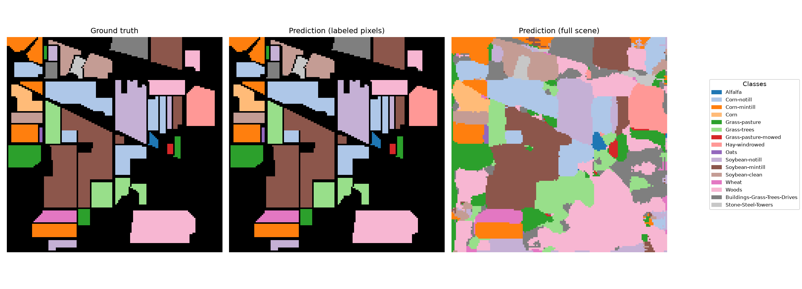
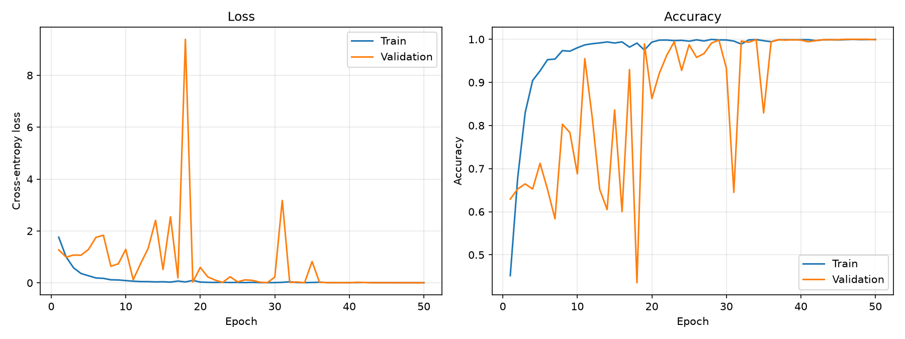
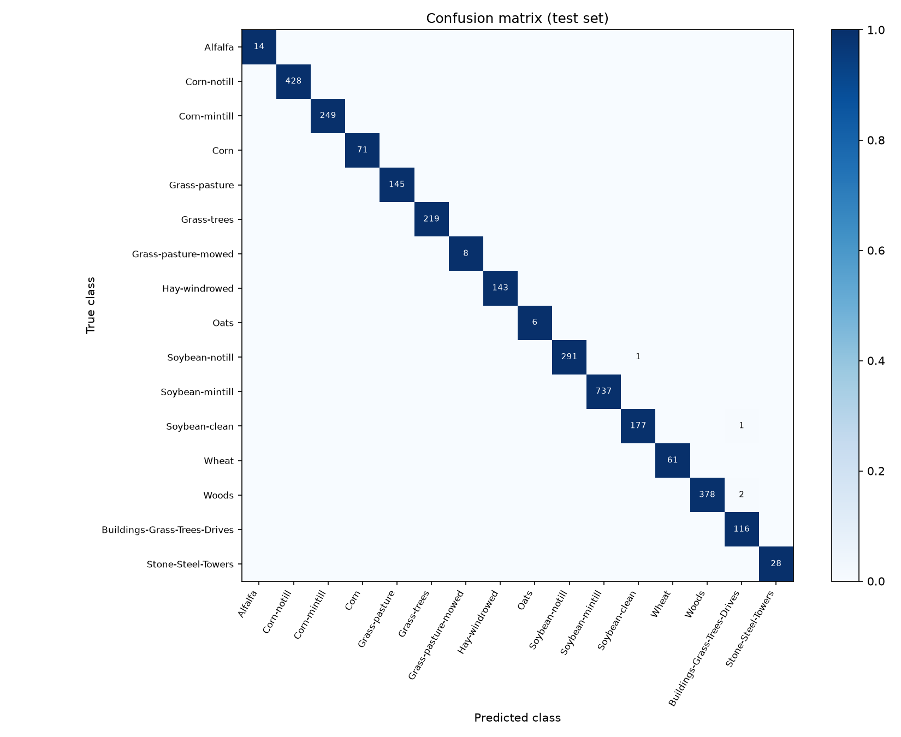

# Hyperspectral Image Classification with a 2D CNN (Indian Pines)

Land-cover classification of the **Indian Pines** hyperspectral scene with a convolutional
neural network in PyTorch. Each pixel is classified from an 11 x 11 patch of its neighborhood,
using all 200 spectral bands as input channels.

This project started as my **TIPE** (*Travail d'Initiative Personnelle Encadré*), the research
project of the French *classes préparatoires* (CPGE), and was later refactored into a
reproducible Python project.

## Context

A hyperspectral camera measures, for every pixel, the reflected light in hundreds of narrow
wavelength bands instead of the 3 bands (RGB) of a regular camera. Each material (a crop,
a soil, a roof) has its own *spectral signature*, which makes it possible to tell apart
classes that look identical in a color image, such as different stages of corn or soybean crops.

The difficulty: 200 features per pixel, only about 10,000 labeled pixels, and very unbalanced
classes (from 20 to 2,455 samples).

## Dataset

Indian Pines, acquired by the AVIRIS sensor over agricultural land in North-western Indiana (USA):

- 145 x 145 pixels, 20 m spatial resolution
- 200 spectral bands (0.4 to 2.5 µm) after removal of the water absorption bands
- 10,249 labeled pixels in 16 classes (corn, soybean, grass, woods, buildings...)

See [`data/README.md`](data/README.md) to download it.

## Method

1. **Normalization**: min-max scaling of each spectral band to [0, 1].
2. **Patch extraction**: for each labeled pixel, an 11 x 11 x 200 patch centered on it
   (zero padding at the borders). The CNN thus uses both the spectrum of the pixel and its
   spatial context. Patches are cut on the fly, which avoids storing a ~1 GB array in memory.
3. **Split**: stratified 60 / 10 / 30 % train / validation / test split, so that every class
   appears in each set in the same proportion. Two spatially disjoint splits are also available
   (`--split blocks` and `--split spatial`, see [Comparison of the splits](#comparison-of-three-splits)).
4. **Model** (`hsi_cnn/model.py`):

   | Layer | Output shape |
   |---|---|
   | Input patch | 200 x 11 x 11 |
   | Conv 3x3 + BatchNorm + ReLU | 32 x 11 x 11 |
   | Conv 3x3 + BatchNorm + ReLU + MaxPool | 64 x 5 x 5 |
   | Conv 3x3 + BatchNorm + ReLU + MaxPool | 128 x 2 x 2 |
   | Linear + ReLU + Dropout (0.5) | 256 |
   | Linear | 16 classes |

5. **Training**: cross-entropy loss, Adam optimizer (learning rate 1e-4, weight decay 1e-4),
   cosine learning-rate schedule, 50 epochs, batch size 64.
6. **Model selection**: the checkpoint with the best **validation** accuracy is kept. The test
   set is used only once, for the final evaluation.

## Results

Metrics on the test set (3,075 pixels never seen during training or model selection):

| Metric | Value |
|---|---|
| Overall accuracy (OA) | 99.87 % |
| Average accuracy (AA) | 99.91 % |
| Cohen's kappa | 0.9985 |

*OA is the fraction of correctly classified pixels. AA is the mean of per-class accuracies,
which gives the same weight to rare classes. Kappa measures agreement beyond chance.
All values are written to `results/metrics.json` by `train.py`.*

### Comparison of three splits

With the random split, **every** test pixel has training pixels inside its 11 x 11 patch
(55 on average), so the network has already seen most of each test neighborhood. Two spatially
disjoint splits remove this overlap. In both, training and validation pixels closer than
5 pixels to a test pixel are discarded, so that no test patch contains a training pixel.

- `--split random` (default): stratified random split of the pixels (the protocol above).
- `--split blocks`: the scene is cut into 16 x 16 blocks, and whole blocks go to train,
  validation or test. Not stratified: a class lying in a single region ends up entirely in one
  set. Four rare classes (Alfalfa, Corn, Grass-pasture-mowed, Oats) often have no training
  pixel and stay in the test set, where they count as errors.
- `--split spatial`: each class is cut along its longest axis into three contiguous regions
  (30 % test, 10 % validation, 60 % train). Every class keeps a training region, except the
  smallest ones (Alfalfa, Grass-pasture-mowed, and sometimes Oats): they are too small to leave
  a 5-pixel gap between training and test, so they are removed from the evaluation.

Mean +/- standard deviation over 5 seeds (0 to 4), 50 epochs each:

| Split | OA | AA | Kappa |
|---|---|---|---|
| Random | 99.74 +/- 0.11 % | 99.44 +/- 0.19 % | 0.9970 +/- 0.0013 |
| Blocks | 54.68 +/- 7.63 % | 43.71 +/- 3.90 % | 0.4668 +/- 0.0818 |
| Spatial (per class) | 56.17 +/- 7.54 % | 64.18 +/- 6.51 % | 0.5068 +/- 0.0826 |

```bash
python train.py --seeds 0 1 2 3 4 --out-dir results/random_5seeds
python train.py --split blocks --seeds 0 1 2 3 4 --out-dir results/blocks
python train.py --split spatial --seeds 0 1 2 3 4 --out-dir results/spatial
```

What this shows:

- **Most of the near-perfect score comes from the overlap** between training and test patches:
  once it is removed, OA drops by more than 40 points with both spatial splits.
- **The two spatial splits give a similar OA** (about 55 %), but a very different AA. With
  blocks, the classes never seen in training score 0 and pull AA down; the per-class split
  learns every class it evaluates, so its AA is higher. The AA values are therefore not
  directly comparable: they are not computed on the same classes.
- **The spatial results depend a lot on the seed** (+/- 7.5 points of OA against +/- 0.1 for
  the random split), because the split itself changes a lot from one seed to another.

Per-seed metrics and figures are in `results/random_5seeds/`, `results/blocks/` and
`results/spatial/`, with the mean and standard deviation in each `summary.json`.

### Classification maps



### Learning curves



### Confusion matrix



## Quick start

```bash
git clone https://github.com/elhindiamjad/tipe-hyperspectral-cnn.git
cd tipe-hyperspectral-cnn
python -m venv .venv && source .venv/bin/activate
pip install -r requirements.txt
# download the two .mat files into data/ (see data/README.md)
python train.py
```

Options (all have defaults):

```bash
python train.py --epochs 100 --lr 5e-4 --patch-size 9 --seed 0
python train.py --split spatial --seeds 0 1 2 3 4   # several seeds -> summary.json
python train.py --help
```

Training takes a few minutes on a GPU and longer on a CPU. Outputs are written to `results/`:
metrics (`metrics.json`), figures, and the best model weights (`best_model.pth`, not tracked by Git).

## Project structure

```
.
├── train.py              # entry point: data -> training -> evaluation -> figures
├── hsi_cnn/
│   ├── data.py           # loading, normalization, patch coordinates, random and spatial splits
│   ├── dataset.py        # PyTorch Dataset cutting patches on the fly
│   ├── model.py          # 2D CNN
│   ├── engine.py         # training / evaluation / prediction loops
│   ├── metrics.py        # OA, AA, kappa, per-class accuracy, confusion matrix
│   ├── plots.py          # figures
│   └── utils.py          # random seed, device
├── notebooks/
│   └── tipe_original.ipynb   # original TIPE notebook (Google Colab)
├── data/                 # dataset goes here (not tracked)
├── results/              # metrics and figures
└── requirements.txt
```

## Limitations and future work

- **Spatial overlap between train and test.** Pixels are split at random, so a test pixel
  often has neighbors in the training set, and their 11 x 11 patches largely overlap. This is
  the usual protocol on Indian Pines, but it makes the scores optimistic compared with a
  model applied to a new area. The spatially disjoint splits above give a more realistic
  estimate (about 55 % OA instead of 99.7 %).
- **Few seeds.** The comparison uses 5 seeds; the spatial scores vary a lot between seeds,
  so more runs would narrow the estimate. The main results table above is a single run (seed 42).
- **Ideas to explore**: dimensionality reduction with PCA before the CNN, 3D convolutions
  (joint spectral-spatial kernels), and other scenes (Pavia University, Salinas).

## References

- Indian Pines dataset: M. Graña, M. A. Veganzons, B. Ayerdi,
  [Hyperspectral Remote Sensing Scenes](https://ehu.eus/ccwintco/index.php/Hyperspectral_Remote_Sensing_Scenes),
  Computational Intelligence Group, University of the Basque Country.
